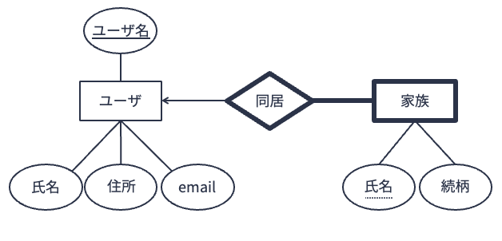

# 望ましくない関係スキーマ

[前講](../er-model/02.md)，[前々講](../er-model/01.md)で扱った実体関連モデルは概念モデルである．
そのため，計算機上で扱える論理モデルに変換する必要がある．

理想的なデータベースは，次のような性質を有するデータベーススキーマを持つ（吉川正俊（著）「[IT Text データベースの基礎](https://www.ohmsha.co.jp/book/9784274223730/)」より）：
1. データに冗長性がない
2. データのもつ一貫性制約の保持が容易である

関係データベースにおいては，上記(1)(2)の要件を満たすように関係スキーマを定義することを**正規化（normalization）** と呼ぶ．
望ましい関係スキーマ，つまり正規化された関係スキーマが設計できれば，関係データベースから**冗長性が排除され（データの重複がなく），データは正しく矛盾なく管理・処理できるようになる**．

このような状態を実現するべく，本講および[次講](02.md)では，理想的な関係データモデルの設計方法について述べる．
はじめに，前講まで扱った実体関連モデルを関係データモデルに変換する方法を述べる．
次に，望ましくない関係スキーマについて述べ，最後に理想的な関係スキーマを導出する方法を述べる．


## 実体関連モデルからの関係スキーマの導出
実体関連図を用いれば，関係データモデルの構造を示す[関係スキーマ](#sec:relation-schema)を機械的に導出することができる．
以下，実体関連図のパターンに応じた関係スキーマへの変換方法を説明する．
以下の説明では，実体関連モデルの解説で用いた[オンラインショッピングの例](#fig:cardinality-constraint)を用いる．

### パターン1: 実体型
実体型を関係スキーマに変換するには，
- 実体型名を関係スキーマの関係名
- 実体型のキーを関係スキーマのキー
- 実体型の属性を関係スキーマの属性

に対応させればよい．


上図に示した実体型「ユーザ」は以下のような関係スキーマに変換される（[★Quiz1★](#db-design1-q1)）．

> $ユーザ(\underline{ユーザ名}, 氏名, 住所, email)$


### パターン2: 関連型
関連型を関係スキーマに変換するには，基本的には
- 関連型名を関係スキーマの関係名
- 関連型とつながる実体型のキーを関連型のキー
- （あれば）関連型の属性を関係スキーマの属性

に対応させればよいが，実体関連間の多重度によってキーの扱いが異なる．

#### 多重度が「多対多」の場合


上の図では，実体型「ユーザ」と「商品」は関連型「購入希望」を介して多対多の関連でつながっている．

このような多対多の関連を関係スキーマに変換する場合は，
関連を一意に識別するために，**関連型につながるすべての実体型の主キーを集めたもの**関連型の主キーとする．
上図の場合，実体型「ユーザ」の主キーは`ユーザ名`，「商品」の主キーは`商品ID`であるため，
関連型「購入希望」の主キーは`{ユーザ名, 商品ID}`となる．

結果的に，関連型「購入希望」は以下のような関係スキーマに変換される．

> $購入希望(\underline{ユーザ名, 商品ID}, 登録日)$


ところで，関連型の関係スキーマの主キーは関連している実体型の主キーから構成されるため，対象となる関連型および実体型を変換した関係スキーマの間には[参照整合制約](#sec:referential-constraint)が生じる．
つまり，関連型の主キーは，関連している（つながっている）実体型に対する外部キーとなる．
例えば，先の例の関係「購入希望」の主キーである`ユーザ名`と`商品ID`は，関係「ユーザ」および「商品」に対する外部キーになっている．
「購入希望」の主キーである`ユーザ名`と`商品ID`の値は，必ず関係「ユーザ」の`ユーザ名`の属性値，「商品」の`商品ID`の属性値として存在していなければならない．
よって，上記関連型を関係スキーマに変換したときには，

> $ユーザ(\underline{ユーザ名}, 氏名, 住所, email)$ \
> $商品(\underline{商品ID}, 商品名, 価格, 発売日)$ \
> $購入希望(\underline{ユーザ名, 商品ID}, 登録日)$ \
> $購入希望.ユーザ名 \subseteq ユーザ.ユーザID$ \
> $購入希望.商品ID \subseteq 商品.商品ID$

が参照整合性制約を含めた関係スキーマとなる（[★Quiz2★](#db-design1-q2)）．


#### 多重度が「多対1」の場合


上の図では，実体型「商品」と「メーカー」は関連型「製造」を介して多対1の関連でつながっている．
すなわち，実体集合「商品」の実体要素が決まれば，それに対応する実体集合「メーカー」の実体要素が必ず1つ特定される．

このような多対1の関連型の場合，矢印のついていない側の実体の主キーの値が決まれば，矢印のついている側の実体が一意に特定されると同時に関連の要素も一意に特定される．
そのため，関係スキーマに変換する場合は，**関連型につながる，矢印のついていない側の実体型の主キー**を関連型の主キーとする．

上図を関係スキーマに変換すると，以下のようになる．
関係「製造」においては，`企業名`が属性になるが主キーにはならない（含まれない）ことに注意しよう（[★Quiz3★](#db-design1-q3)）．

> $商品(\underline{商品ID}, 商品名, 価格, 発売日)$ \
> $メーカー(\underline{企業名}, TEL, email)$ \
> $製造(\underline{商品ID}, 企業名)$ \
> $製造.商品ID \subseteq 商品.商品ID$ \
> $製造.企業名 \subseteq メーカー.企業名$


#### 多重度が「1対1」の場合


上の図では，実体型「メーカー」と「画像」は関連型「ロゴ」を介して1対1の関連でつながっている．

このような1対1の関連型の場合，関連している**いずれか**の実体型の主キーの値が決まれば，関連の要素も一意に特定される．
そのため，関係スキーマに変換する場合は，**関連型につながる，いずれかの実体型の主キー**を関連型の主キーとする．

上図を関係スキーマに変換すると，以下のようになる．
関係「ロゴ」においては，`画像ID`が属性になるが主キーにならない（含まれない）ことに注意しよう．

> $メーカー(\underline{企業名}, TEL, email)$ \
> $画像(\underline{画像ID}, サイズ, ファイルパス)$ \
> $ロゴ(\underline{企業名}, 画像ID)$ \
> $ロゴ.企業名 \subseteq メーカー.企業名$ \
> $ロゴ.画像ID \subseteq 画像.画像ID$


### パターン3: 汎化・継承
IsA階層を使って実体型$E_1$を継承した実体型$E_2$を関係スキーマに変換するには，実体型と同じ変換方法を用いればよい．
すなわち
- 継承先の実体型名を関係スキーマの関係名
- 継承元の実体型のキーを関係スキーマのキー
- 継承先の実体型の属性を関係スキーマの属性

に対応させればよい．
継承先の実体型の主キーは継承元の実体型の主キーとすることに注意しよう．


上図に示した実体型「プレミアムユーザ」は，以下のような関係スキーマに変換される（[★Quiz4★](#db-design1-q4)）．

> $プレミアムユーザ(\underline{ユーザ名}, 登録日)$


### パターン4: 弱実体型と弱関連型


上の図のような弱実体・弱関連の関係スキーマへの変換はややトリッキーである．
[弱実体](#sec:weak-entity)は自らの属性だけでは自らを一意に特定できないため，弱関連型を通じてつながる（所有）実体型の主キーと自らの属性（部分キー）をセットにして主キーとする必要があった．
このことを踏まえて，弱実体型は以下のように関係スキーマに変換する．

- 弱実体型の名前を関係スキーマの関係名にする
- 弱実体型の部分キーおよび弱実体型とつながる（所有）実体型の主キーをセットにしたものを関係の主キーとする
- 弱実体型の属性を関係スキーマの属性とする

上の図の弱実体型「家族」は以下のような関係スキーマに変換される．

> $家族(\underline{ユーザ名, 氏名}, 続柄)$

なお，弱実体型の主キーを構成する要素のうち，部分キーでない方は別の実体型の主キーを借りており，参照整合性制約が生じる．
つまり，外部キーとなっている．
上の例の実体型「家族」であれば，`ユーザ名`が外部キーに相当する．
そのため，以下のような参照整合性制約を関係スキーマに加える必要がある．

> $家族.ユーザ名 \subseteq ユーザ.ユーザ名$

弱関連型は
- 弱関連型名を関係スキーマの関係名
- 自らの部分キーと弱関連型でつながる（所有）実体型の主キーのセットを関係スキーマの主キー
- 弱関連型の属性を関係スキーマの属性

に対応させることで関係スキーマに変換する．

上図の弱関連型「同居」は，以下のような関係スキーマに変換される．

> $同居(\underline{ユーザ名}, \underline{氏名})$ \
> $同居.ユーザ名 \subseteq ユーザ.ユーザ名$ \
> $同居.氏名 \subseteq 家族.氏名$

ところで，弱実体型「家族」は，弱関連型「同居」に対する参加制約が全体的である．
また，弱実体型「家族」に対応する関係スキーマ「家族」の属性は弱関連型「同居」に対応する関係スキーマ「同居」の属性を包含している．
このことは，関係「家族」があれば関係「同居」は把握でき，関係「同居」は不要であることを意味する．
よって，関係スキーマ「同居」は削除できる．


## 異状
上記手順によって，実体関連モデルを関係スキーマに機械的に変換することができる．
しかしながら，変換元となる実体関連モデルの質によっては，冗長性を排除してデータを正しく扱う上で望ましい関係スキーマが得られないことがある．

「望ましくない」関係スキーマを用いると，データを追加・削除・修正しようとしたときに**更新時異状（update anomaly）** と呼ばれる不都合な状態が発生する．
以下，更新時異状を「挿入時異状」「削除時異状」「修正時異状」の3つに分けて説明する．


### 挿入時異状
架空ショッピングサイトの管理人である山畑さんが，ショッピングサイトの購買履歴を管理するデータベースを作るために，次のような関係スキーマを定義したとしよう．

> $購買(\underline{購買ID}, ユーザ, 購入商品, 単価, 数量)$

山畑さんは購買履歴だけでなく，サイトで取り扱っている商品の情報についても関係「購買」の中で扱おうと考えた．
その結果，蓄積されたレコード（タプル）が以下の通りである．


さて，山畑さんのショッピングサイトでは，新商品として`たきのこの里山`の取り扱いを開始することになった．
新商品の情報をデータベースに登録するために，山畑さんは以下の図のように「購買」テーブルに`(NULL, NULL, たきのこの里山, 250, NULL)`というレコードを追加しようとした．
しかし，データベースから拒否されてしまった．
理由は関係「購買」のスキーマにおいては`購買ID`が主キーとして設定されているため，主キーの値がないレコード`(NULL, NULL, たきのこの里山, 250, NULL)`は追加できないからである．


このように，レコードを挿入しようとしたときに発生する不都合な現象を**挿入時異状（insertion anomaly）** と呼ぶ（[★Quiz7★](#db-design1-q7)）．


### 削除時異状
次に，購買実績が1件しか存在しない`のど飴`について，ユーザ`U2`が払い戻しを希望したため，購買履歴から記録を削除することにしたとしよう．
このとき，**削除時異状（deletion anomaly）** と呼ばれる現象が発生する．
このデータベースでは，取扱商品についても関係「購買」で管理している．
そのため，今回のケースに対応する表の3行目（購買IDが`T3`）のレコードを削除すると，以下のような図の状態になり，商品`のど飴`の情報（単価情報など）が失われてしまうのである．


このように削除時異状とは，データベースの利用者が意図したよりも多くの情報が失われてしまう現象を指す．

なお，購買IDが`T3`のレコードを削除した後に，`のど飴`の商品情報が消えてしまったことに気づいた山畑さんは，焦って`(NULL, NULL, のど飴, 170, NULL)`というレコードを追加して，`のど飴`の商品情報を復活させようとした．
しかし，挿入時異状となり，データベースからは拒否される（[★Quiz6★](#db-design1-q6)）．


### 修正時異状
最後は，**修正時異状（modification anomaly）** である．

山畑さんは`はーいお茶`の単価が`120`円であるにもかかわらず，勘違いして`130`円として購買テーブルに登録し続けていたとしよう．
データベースに登録されたデータの修正が必要になる．
`はーいお茶`に関する購買は，購買IDが`T1`および`T5`の2件が該当する．
そのため，以下の図のように，この2件の「単価」の値を`120`に書き換える必要がある．


ところで，今回の勘違いは「はーいお茶の単価が120円の間違いだった」という単一の商品に関する修正事象にもかかわらず，データベース上では2件のレコードの書き換え（修正）が発生している．
今回購買テーブルの中で`はーいお茶`の購買履歴が2件しかなかったが，修正対象となる履歴が100万件あれば100万回の修正が必要になる．
この処理は明らかに冗長である．

このように，データベース上のデータの修正時に関わる不都合を修正時異状と呼ぶ（[★Quiz5★](#db-design1-q5)）．


## 情報無損失分解
上記の例で挙げたような更新時異状が発生するのはなぜだろうか．
問題の原因は，独立して扱えるはず情報が1つの関係の中に混在していることにある．
先の購買履歴の例の場合，単価などの商品固有の情報は購買履歴とは独立に扱えるはずである．
よって，更新時異状が発生しないようにするには，関係「購買」を分解して商品固有の情報を別の関係として管理すればよい．

(sec:lossless-decomposition)=
以下は，先の関係「購買」を
- 関係「購買履歴」（関係「購買」の {購買ID, ユーザ, 購入商品, 数量} 上の[射影](#sql-projection)）
- 関係「商品」（関係「購買」の {購入商品, 単価} 上の射影）

に分解したものである．


このように関係「購買」を分解すれば，
- 新商品`たきのこの里山`を追加する場合，関係「商品」に`(たきのこの里山, 250)`というレコードを追加
- 購買IDが`T3`の「のど飴」に関する購買をなかったことにするには，関係「購買履歴」から購買IDが`T3`のレコードを削除
- `はーいお茶`の単価を`130`円から`120`円に修正する場合，関係「商品」の`はーいお茶`に関する1レコードのみを修正

すれば更新時異状は発生しない．

なお，関係「購買履歴」と関係「商品」は

```sql
SELECT
    *
FROM
    購買履歴
JOIN
    商品 USING（購入書品）;
```

というSQL文でデータベースに問い合わせを行うことで，元の関係「購買」の情報を完全に復元できる．
このように，ある関係をその情報を失うことなく2つの関係に分解することを**情報無損失分解** と呼ぶ．


```{warning}
情報無損失分解における「分解」は**タプルの重複が許されない射影**操作であることに注意しよう．
直感的には，射影操作は関係（表）から特定の属性（列）項目にデータを抽出する操作であるが，
単に特定の列のデータを抽出するだけの場合，下記のように抽出結果内でタプルが重複する可能性がある．


**タプルの重複が許されない射影** とは，以下のような操作である．
上の例とは違い，タプルの重複は取り除かれている．
特に指定がなければ，SQLでは問い合わせ結果にタプルの重複があっても許されてしまう．
タプルの重複がない問い合わせを行うには，`DISTINCT`を指定しよう．


```


```{important}
### 関係代数における射影

関係データモデルにおける関係の操作は，**関係代数**あるいは**関係論理**という演算体系として理論的に確立されている．
関係代数（あるいは関係論理）で扱う「関係」とは数学的には「集合」である．
一般に，集合は要素の重複は許されない．
関係データモデルにおける射影操作の結果は関係であるため，当然関係の要素に重複は許されず，重複は除外される．
```


関係を分解する目的は「データベースにおけるデータの挿入，削除，修正の影響が極力小さくすること」にあるが，適当に分解すればOKというわけではない．
分解の仕方によっては，情報無損失分解ではなく情報"損失"分解になりえる．

(sec:lossy-decomposition)=
情報"損失"分解の例を見てみよう．
以下は，先の関係「購買」を
- 関係「購買1」（関係「購買」の {購買ID, ユーザ} 上の射影）
- 関係「購買2」（関係「購買」の {ユーザ, 購入商品, 数量, 単価} 上の射影）

に分解したものである．


これら2つの関係を属性「ユーザ」をもとに結合してみよう．
以下は関係「購買1」と「購買2」を結合した結果について問い合わせを行うSQL文である．

```sql
SELECT
    *
FROM
    購買1
JOIN
    購買2 USING (ユーザ）;
```

上記SQL文を実行すると，以下のような結果が得られる．
元の関係「購買」にはなかったレコードが追加されている．
関係「購買」から「購買1」と「購買2」への分解では，情報の保存に失敗している．
そのため，結合をしても元の情報を復元できなくなってしまったのである．


上で挙げた2例を比較したとき，[関係「購買」を関係「購買履歴」と「商品」に分解する例](#sec:lossless-decomposition)ではなぜ情報無損失分解に成功したのであろうか．
成功要因は，分解の軸となった属性「購入商品」においては，「購入商品」の値（名前）が決まればそれに対応する「単価」の値も一意に決まることにある．
逆に，[関係「購買」を関係「購買1」と「購買2」に分解する例](#sec:lossy-decomposition)が情報無損失分解に失敗した理由は，分解の軸となった属性「ユーザ」の値（名前）が決まっても，それに対応する「購入商品」「単価」「数量」の値が一意に決まらないからである（[★Quiz8★](#db-design1-q8)）．

---

## クイズ

(db-design1-q1)=
### Q1: 関係スキーマへの変換（1/4）
以下は，架空のショッピングサイトにおける購買履歴を管理するシステムの実体関連図である．
図中の実体型「ユーザ」「注文」「商品」「メーカー」を関係スキーマに変換せよ．


(db-design1-q2)=
### Q2: 関係スキーマへの変換（2/4）
Q1の実体関連図における関連型「明細」を関係スキーマに変換せよ．
参照整合性制約が存在する場合にはそれも記すこと．


(db-design1-q3)=
### Q3: 関係スキーマへの変換（3/4）
Q1の実体関連図における関連型「製造」「購買履歴」を関係スキーマに変換せよ．
参照整合性制約が存在する場合にはそれも記すこと．


(db-design1-q4)=
### Q4: 関係スキーマへの変換（4/4）
Q1の実体関連図における実体型「有料会員」を関係スキーマに変換せよ．


(db-design1-q5)=
### Q5: 修正時異状
架空の家具販売店「八高家具」では顧客と購入希望商品の「ペア」（誰が何の商品の購入を希望しているか）で営業担当を割り当てている．
営業担当は年度ごとに営業成績が評価されることになっている．

八高家具では，下記関係スキーマに従った関係データモデルを用いて営業記録，取扱商品，営業成績の管理を行っている．

> $営業記録(\underline{ユーザ, 商品}, 連絡先, メーカー, 営業担当, 営業成績)$

以下の表は，関係スキーマ`営業記録`にしたがって八高家具における営業記録を記録した関係（表）である．
営業担当者の成績の修正に際して，関係「営業記録」のみを用いてデータを管理する際に発生しうる修正時異状の例を挙げよ．


(db-design1-q6)=
### Q6: 削除時異状
架空の家具販売店「八高家具」では，以下のような修正した関係スキーマを用いて，改めて営業記録をつけはじめた．

> $営業記録2(\underline{ユーザ, 商品}, 連絡先, メーカー, 営業担当)$


以下の表は，新しい関係スキーマ`営業記録2`にもとづいた営業記録の表である．
営業記録の削除に際して，関係「営業記録2」のみを用いてデータ管理する際に発生しうる削除時異状の例を挙げよ．


(db-design1-q7)=
### Q7: 挿入時異状
架空の家具販売店「八高家具」では以下のようなさらに修正した関係スキーマを用いて改めて営業記録をつけはじめた．

> $営業記録3(\underline{ユーザ, 商品}, メーカー, 営業担当)$


以下の表は，新しい関係スキーマ`営業記録3`にもとづいた営業記録の表である．
取り扱い商品の追加に際して，関係「営業記録3」のみを用いてデータ管理する際に発生しうる挿入時異状の例を挙げよ．


(db-design1-q8)=
### Q8: 削除，挿入，修正
架空の家具販売店「八高家具」では，データエンジニアのアドバイスに基づき，
以下の2つの関係スキーマを用いて，改めて営業記録と取り扱い商品の管理を行うことにした．

> $営業記録4(\underline{ユーザ, 商品}, メーカー, 営業担当)$ \
> $商品(\underline{商品}, メーカー)$

以下の表は，新しい関係スキーマにもとづいた営業記録，取扱商品の関係データベースである．
この関係データベースに対して以下の操作を行った結果を記せ．

1. `ソファベッド`のメーカーを`A社`から`E社`に変更
2. `西尾`担当によるユーザ`tanabee`に対する`本棚(大)`の営業記録を削除
3. `春日井`担当によるユーザ`north1000`に対する`オフィスチェア`（メーカー`D社`の新商品）の営業記録を追加


