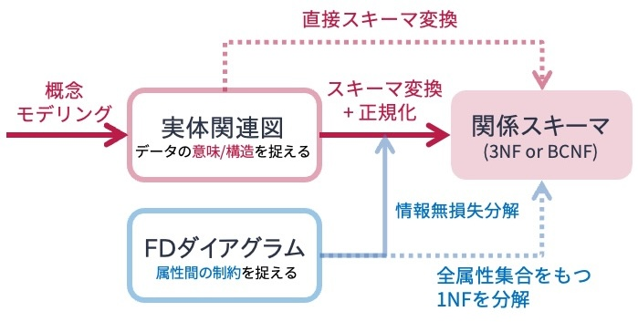

# データ従属性にもとづく正規化
データに重複がなく，データが正しく管理・処理される望ましい関係スキーマを得るためには，関係を[情報無損失分解](#sec:lossless-decomposition)する必要がある．
では，何を頼りに情報無損失分解を行えばよいだろうか．
情報無損失分解の鍵は「**データ従属性**」にある．

本講では，代表的なデータ従属性である**関数従属性** の概念を（再）導入した後，それに基づく関係の正規化手法について述べる．


## 関数従属性
[関係データモデルの講](../relational-data-model/01.md)で触れたように，**関数従属性（functional dependency）** は「関係$\boldsymbol{R}$においてその属性（あるいは属性集合）$X$の値が決まると属性（あるいは属性集合）$Y$の値も一意に決まる」という性質である．
関係$\boldsymbol{R}$において属性$Y$が属性$X$に関数従属していることを

> $X \to Y$

と記す．
例えば

> $連絡先(\underline{学生ID}, 名前, 学年, 郵便番号, 自宅住所)$

という関係スキーマに従う，以下のような関係「連絡先」を考えよう．


関係「連絡先」上ではいくつかの関数従属性が考えられる．
例えば，属性「学生ID」は関係「連絡先」の主キーであるため，

> $\{学生ID\} \to \{名前, 学年, 郵便番号, 自宅住所 \}$

という関数従属性が成立する．
また，一般常識として，住所が決まれば対応する郵便番号は一意に決まる．
それゆえ，

> $\{住所\} \to \{郵便番号 \}$

という関数従属性も成立する．


ところで，関係「連絡先」においては

> $\{郵便番号, 住所\} \to \{郵便番号 \}$

という関数従属性も成立する．
これは関係「連絡先」においては，「郵便番号」と「住所」の値が決まれば，それに対応する「郵便番号」の値が決まるという意味である．
この関数従属性は自明である．
なぜなら，右辺の要素が左辺の要素の部分集合になっているからである．
一般に，関数従属性として注目されるのは**自明でない関数従属性**である．
以下，断りなく「関数従属性」と記した場合は，自明でない関数従属性を意味する．


もう1例見てみよう．
以下の図は

> $営業記録(\underline{ユーザ, 商品}, 連絡先, メーカー, 営業担当, 営業成績)$

という関係スキーマに従う関係「営業記録」である．
「ユーザ」が購入しようとしている「商品」がどこの「メーカー」の何で，その商品の「営業担当」が誰でどんな「営業成績」を持っている人かの情報が管理されるとしよう．


関係「営業記録」上では，以下のような関数従属性が成立するとしよう[^関数従属性の表記]．

[^関数従属性の表記]: 関数従属性の両辺は属性集合であるが，慣例により集合を表す波括弧は省略される．


> $FD_1: ユーザ, 商品 \to 営業担当$ \
> $FD_2: ユーザ \to 連絡先$ \
> $FD_3: 商品 \to メーカー$ \
> $FD_4: 営業担当 \to 営業成績$

このとき，例えば関数従属性$FD_1$は，関係「営業記録」においては，ユーザと商品が決まれば担当者が決まるということを意味している（ユーザだけでは担当者は決まらないという意味でもある）（[★Quiz1-1★](#db-design2-q1-1)）．


(sec:fd-diagram)=
### FDダイアグラム
ある関係スキーマの上に定義された複数の関数従属性は，**FDダイアグラム**と呼ばれる図によって表現できる．
例えば，先の関係「営業記録」とその関数従属性$FD_1$，$FD_2$，$FD_3$，$FD_4$は以下のように図示できる．


FDダイアグラムでは，属性の集合は丸で囲まれる．
上の図では属性「ユーザ」と「商品」が丸で囲まれており，これら2つの属性がセットになったものに対して属性「営業担当」が関数従属していること表している．
このようにFDダイアグラムを用いることで，関係上に成立する関数従属性を視覚的に把握することができる（[★Quiz1-2★](#db-design2-q1-2)，[★Quiz1-3★](#db-design2-q1-3)）．


```{note}
### FDダイアグラムの別表記
なお，資料や文献によっては，FDダイアグラムを以下のような図で表現する場合がある．


```


## 関数従属性にもとづく関係の正規化
関係データベースの設計においては，以下の性質を有する関係スキーマを設計することが目標となる．
1. データに冗長性がない
2. データが持つ一貫性制約の保持が容易である

[前講](01.md)で述べたように，上記性質を持つ関係スキーマを設計することを**正規化（normalization）** という．
また，正規化された関係は**正規形である（normalized）** という．
正規化の条件として，正規化後に得られた関係の集合が保持しているデータ内容は，正規化前の関係が保持しているデータ内容と等しくならなければならない．
また，正規化前と正規化後の関係が保持する一貫性制約も等しくならなければならない．．

以下の図のように，正規形にはいくつかのレベルがある．
[関係データモデルの講](../relational-data-model/01.md)で説明した[第1正規形](#sec:1NF)から始まり，第5正規形まである．
関係の正規化は，関数従属性をはじめとする**データ従属性を考慮する**ことで実現される．
本講では，関数従属性に着目して，第1正規形の関係スキーマから実用上重要とされるボイス・コッド正規形を得る手順を説明する．


### ボイス・コッド正規形
まず，本講の最終目標であるボイス・コッド正規形について述べる．
なお，第1正規形からボイス・コッド正規形に至るまでに第2正規形と第3正規形があるにもかかわらず，先にボイス・コッド正規形を説明する理由は下記の通りである：
- 第3正規形はボイス・コッド正規形の制約を緩めたものであるため，先にボイス・コッド正規形を説明したほうが分かりやすいため
- 第2正規形はボイス・コッド正規形および第3正規形を導出する過程で得られる中間生成物であり，重要性が低いため

**ボイス・コッド正規形（Boyce-Codd normal form; BCNF）** は以下のように定義される：

```{important}
#### 定義：ボイス・コッド正規形

関係スキーマ$\boldsymbol{R}$において成立するどのような自明でない関数従属性$X \to Y$においても，$X$が$\boldsymbol{R}$の超キーであるとき，$\boldsymbol{R}$はボイス・コッド正規形であるという．
```

[関係データモデルの講](#sec:key-constraint)では，
- 超キーとは，関係$\boldsymbol{R}$における属性集合のうち，それらの属性値が決まればおのずと関係$\boldsymbol{R}$のタプルが唯一ひとつに決まる（タプルを一意に特定できる）もの
- 超キーのうち最も小さい部分集合（つまり極小な集合）を候補キー

と定義した．
ボイス・コッド正規形とは，関係$\boldsymbol{R}$おいて成立するあらゆる関数従属性の左辺を候補キーの上位集合（つまり超キー）に限定することで，関数従属性に関するあらゆる冗長性を排除したものと捉えることができる．


形式的な話が続いたので，実例を見てみよう．
以下は，上の例で用いた関係「営業記録」を適当に分解して得られた関係の上で成立する関数従属性を図示したものである．
なお，関係「営業記録」のキーは`{商品, ユーザ}`である．
このFDダイアグラムで表現された関係スキーマはボイス・コッド正規形ではない．
なぜなら，この関係スキーマにおいては属性集合`{商品, ユーザ}`が（唯一の）候補キーになるが，関数従属性$FD_4$の左辺は候補キー以外の属性（`営業担当`）から構成されているからである．


別の例を見てみよう．
以下のFDダイアグラムが示す関係のキーは`{商品, ユーザ}`である．
このFDダイアグラムで表現された関係スキーマもボイス・コッド正規形ではない．
先ほどと同様，この関係スキーマにおいては属性集合`{商品, ユーザ}`が（唯一の）候補キーになるが，関数従属性$FD_2$および$FD_3$の左辺は，候補キーの上位集合ではなく「候補キーの部分集合」になっている．
そのため，ボイス・コッド正規形の定義に反する．


もう1例見てみよう．
以下のFDダイアグラムが示す関係のキーも`{商品, ユーザ}`である．
このFDダイアグラムで表現された関係スキーマはボイス・コッド正規形である．
なぜなら，関数従属性$FD_1$の左辺は候補キーそのものだからである．


### 関数従属性による情報無損失解
関数従属性による正規化を行うにあたり，以下の定理が成立することが知られている．

```{important}
#### 定理：情報無損失分解
属性集合$U$上の関係$\boldsymbol{R}$において，関数従属性$X \to Y$が成立するならば，関係$\boldsymbol{R}$は
- 関係$\boldsymbol{R}$を属性集合$X \cup Y$上に射影した関係$\boldsymbol{R_1}$
- 関係$\boldsymbol{R}$を属性集合$X \cup (U - Y)$上に射影した関係$\boldsymbol{R_2}$[^注意]

の2つの関係に情報無損失分解することができる．
```

[^注意]: $U-Y$ではなく$X \cup (U-Y)$とする理由は，$U$に属さない別の関係の属性$X$において$X \to Y$となる場合もありえるからである．

具体例を考えてみよう．
以下は，[前講](01.md)で用いた架空ショッピングサイトの購買履歴を扱う関係「購買」である．
関係「購買」の関係スキーマは

> $購買(\underline{購買ID}, ユーザ, 購入商品, 単価, 数量)$

である．


一般常識から，関係「購買」において関数従属性

> $購入商品 \to 単価$

が成立するのは自明である（としよう）．
では，先の定理を当てはめてみよう．

> $U = \{購買ID, ユーザ, 購入商品, 単価, 数量\}$ \
> $X = 購入商品$ \
> $Y = 単価$ \
> $X \cup Y = \{購入商品, 単価\}$ \
> $U - Y = \{購買ID, ユーザ, 購入商品, 数量\}$ \
> $X \cup (U - Y) = \{購買ID, ユーザ, 購入商品, 数量\}$

になるので，関係「購買」は
> $\boldsymbol{R_1}(購買ID, ユーザ, 購入商品, 数量)$ \
> $\boldsymbol{R_2}(購入商品, 単価)$

に従う2つの関係に情報無損失分解できる．
この結果は[前講の例](#sec:lossless-decomposition)で扱った情報無損失分解の結果と一致する．
形式的に書くと小難しく感じるが，要するに
- 関数従属性の両辺（$X \cup Y$）からなる関係
- 関数従属性の左辺（$X$）と右辺以外の属性集合（$U-Y$）からなる関係

に分解すれば情報無損失分解となる．


### 分解法
関数従属性を使って関係を情報無損失分解する方法が分かったので，この方法を使ってボイス・コッド正規形を導出することができる．
具体的には，関係$\boldsymbol{R}$における属性集合と$\boldsymbol{R}$の上で成立する（複数の）関数従属性が与えられたとき，
1. $\boldsymbol{R}$が非正規形の場合，第1正規形に変換する．
2. 関数従属性のどれか1つに着目する
3. ステップ2で選んだ関数従属性をもとに関係$\boldsymbol{R}$を情報無損失分解する
4. 分解して得られた関係がボイス・コッド正規形になるまで，ステップ2とステップ3を繰り返す

という流れで正規化を行う．
この手続きにもとづく関係スキーマの設計方法は**分解法**と呼ばれる．
分解法で導出された関係の集合が保持しているデータ内容は，分解前の関係が保持しているデータ内容と等しくなる．
また，分解前と分解後の関係が保持する一貫性制約も等しくなる．

(fig:to-BCNF)=
[FDダイアグラムの説明の例](#sec:fd-diagram)で用いた関係スキーマ「営業記録」のFDダイアグラムを使って，
関係スキーマ「営業記録」をボイス・コッド正規形になるまで分解してみよう．
以下の図は，FDダイアグラムが分解されていく様子を図示したものである．


上記の図では，関数従属性$FD_4$，$FD_2$，$FD_3$の順で情報無損失分解を行うことで，ボイス・コッド正規形の関係スキーマを導出している．
この例では，最終的に関係スキーマ「営業記録」からボイス・コッド正規形の関係スキーマ

> $\boldsymbol{R_1}(\underline{商品}, \underline{ユーザ}, 営業担当)$ \
> $\boldsymbol{R_2}(\underline{ユーザ}, 連絡先)$ \
> $\boldsymbol{R_3}(\underline{商品}, メーカー)$ \
> $\boldsymbol{R_4}(\underline{営業担当}, 営業成績)$

が導出されている．
4つの関係スキーマは，更新時異状が起きないように正規化されている．
また，関数従属性$FD_1$，$FD_2$，$FD_3$，$FD_4$も保存されている．
そのため，この4つの関係スキーマを用いて関係データベースを構築すれば，冗長性を排除しつつデータをできる限り正しく管理・処理することができる（[★Quiz2★](#db-design2-q2)）．


### 第3正規形
関係「営業記録」の例では，問題なくボイス・コッド正規形を導出できた．
しかし実際には，関係をボイス・コッド正規形まで情報無損失分解できないケースもしばしばある．

以下の図は，先の例の関係「営業記録」の関数従属性に

> $FD_5: 営業担当 \to 商品$

が加えられたFDダイアグラムである．
営業担当者ごとに担当する商品が決まっていることを示す，現実にあり得そうな制約条件である．


このFDダイアグラムに従い，関係スキーマ「営業記録」を分解するとしよう．
以下のように，$FD_4$，$FD_2$，$FD_3$を使ってこの順で分解したとする．


すると，以下の関数従属性$FD_1$および$FD_5$のをもつ関係スキーマ$\boldsymbol{R}(ユーザ, 商品, 営業担当)$が得られる．

> $FD_1: 商品, ユーザ \to 営業担当$ \
> $FD_5: 営業担当 \to 商品$

この関係スキーマは，惜しくもボイス・コッド正規形になっていない．
関数従属性$FD_1$はその左辺に関係スキーマ$\boldsymbol{R}$の候補キーの上位集合の属性（`{商品, ユーザ}`）をもっているが，
$FD_5$はその右辺に$\boldsymbol{R}$の候補キーの部分集合（`商品`）をもってしまっているためである．


(fig:3NF)=


関係スキーマ$\boldsymbol{R}(ユーザ, 商品, 営業担当)$は，下の図のように関数従属性$FD_5$で情報無損失分解することができる．


この分解によって得られる関係スキーマは

> $\{R_1(商品, 営業担当), \{営業担当 \to 商品\}\}$ \
> $\{R_2(ユーザ, 営業担当), \{\}\}$

である．
これら2つの関係スキーマはそれぞれボイス・コッド正規形である．
しかしながら，情報無損失分解前の関係$\boldsymbol{R}(ユーザ, 商品, 営業担当)$において存在していたはずの関数従属性$FD_1$が失われてしまっている．
このように分解対象となるスキーマによっては，情報無損失分解に成功しても，元のスキーマ上に存在していた関数従属性が保持できないケースがある．

そこで，ボイス・コッド正規形の定義を若干緩めた関数従属性を保持する**第3正規形（3rd normal form; 3NF）** が定義されている．

```{important}
#### 定義：第3正規形

関係スキーマ$\boldsymbol{R}$において成立するどのような自明でない関数従属性$X \to Y$においても，以下の(1)(2)のいずれかを満たすとき，$\boldsymbol{R}$は第3正規形であるという．

1. $X$が$\boldsymbol{R}$の超キーである
2. $Y$が$\boldsymbol{R}$の候補キーの要素である
```

1つ目はボイス・コッド正規形であるための条件である．
2つ目はボイス・コッド正規形の要件を満たさない場合に対応するためのOR条件である．
定義上，ボイス・コッド正規形はすべて第3正規形である．

[先の図](#fig:3NF)における関係スキーマ$\boldsymbol{R}(ユーザ, 商品, 営業担当)$は
- 候補キー`{商品, ユーザ}`を左辺とする関数従属性$FD_1$
- 候補キーの一部である`商品`を右辺とする関数従属性$FD_5$

をもつ．
これは上記の条件(1)(2)を満たしている．
そのため，関係スキーマ$\boldsymbol{R}(ユーザ, 商品, 営業担当)$は第3正規形となる．

第3正規形もボイス・コッド正規形も候補キーに関する関数従属性を保持する正規形であるが，
第3正規形が候補キーが関数従属性の**左辺，右辺のいずれか**に関わることを条件にしている．
それに対して，ボイス・コッド正規形は候補キー（とその上位集合）が関数従属性の**左辺に現れることのみ**を条件とした少し厳しいものになっている（非キー属性から候補キー要素への関数従属性条件を排除）（[★Quiz3★](#db-design2-q3)，[★Quiz4★](#db-design2-q5)）．


## 望ましい関係スキーマを得る手順のまとめ
以下の図は，概念モデリングからはじめて第3正規形もしくはボイス・コッド正規形を得るための手順をまとめたものである．
本講義資料では実体関連図を作成した後，それを関係スキーマに機械的に変換し，正規化が不十分なものについてはFDダイアグラムを用いて情報無損失分解を行う流れで，正規化された関係スキーマを導出する方法を解説した．

図の点線で示したように，実体関連図が適切に作られていれば，それを機械的にスキーマ変換するだけで，第3正規形もしくはボイス・コッド正規形の関係スキーマが得られる．
一方，実体関連図を作成しなくても，データベースで扱うことが想定される全属性を並べた第1正規形の関係スキーマ，および想定されうる関数従属性だけを使って，第3正規形もしくはボイス・コッド正規形の関係スキーマを設計することも可能である．
そのような場合でも，**実体関連図とFDダイアグラムを併用**して関係スキーマを導出することをオススメする．

その理由は，実体関連図のみを用いたスキーマ設計を行う場合，現実世界の構造や制約が作成した実体関連図に適切に反映されていなければ，十分に正規化された関係スキーマを得られないからである．
また，関数従属性のみを用いたスキーマ設計を行う場合，関数従属性はあくまで属性間に成立する制約にのみ注目しているため，実体関連モデルのようにデータの持つ意味や構造が意識されないからである．

関係データモデルの正規化レベルとしては第1正規形から第5正規形まで定義されているが，第3正規形やボイス・コッド正規形までの正規化で十分と言われることが多い．
しかしながら，どの程度のレベルまで正規化を行うかは，想定しているサービスやアプリケーションに依る．
例えば，SNSの投稿のようにデータの生成頻度は高いが更新頻度は低いサービスにおいては，データ整合性の担保や冗長性の排除よりも問い合わせ処理の速度が優先される場合もある．
そのようなケースでは，ゴリゴリに関係の正規化を行わない，あるいは関係データベースではない別種のデータベースを用いることも視野に入れる必要がある．



---


## クイズ


### Q1: Orange Music
架空のサブスクリプション型音楽ストリーミングサービスであるOrange Musicでは，楽曲に対するユーザの評価スコアを関係「評価」で管理している．
関係「評価」の関係スキーマは以下の通りである．

> $\{\boldsymbol{評価}(ユーザ名, 楽曲, アーティスト, 収録アルバム, ジャンル, スコア), \{FD_1, FD_2, FD_3, FD_4\}\}$ \
> $FD_1: ユーザ名, 楽曲 \to スコア$ \
> $FD_2: 楽曲 \to 収録アルバム$ \
> $FD_3: 楽曲 \to ジャンル$ \
> $FD_4: 収録アルバム \to アーティスト$

なお，Orange Musicでは，アルバムに収録されている楽曲しか配信対象になっていないと仮定する．
また，同名の楽曲，アルバム，アーティストは存在しないと仮定する．


(db-design2-q1-1)=
#### Q1-1: 関数従属性
Q1で定義した定義した関係スキーマ「評価」を満たす関係を適当に例示せよ．
タプルの数は5〜6でよい．

(db-design2-q1-2)=
#### Q1-2: 主キー
Q1で定義した関係スキーマ「評価」において想定されるキーは何か．

(db-design2-q1-3)=
#### Q1-3: FDダイアグラム
Q1で定義した関係スキーマ「評価」で定義された関数従属性をFDダイアグラムで表現せよ．


(db-design2-q1-4)=
#### Q1-4: 関数従属性にもとづく正規化
Q1-2で作成したFDダイアグラムを用いて，関係スキーマ「評価」をボイス・コッド正規形へ分解せよ．
なお，途中過程も示すこと．
また，分解の過程で得られる関係スキーマに正規化レベルを付与すること（例: 第1正規形）．


(db-design2-q2)=
### Q2: 分解順序と結果の関係
[こちらの図](#sec:fd-diagram)に記した関係スキーマ「営業記録」について，$FD_2$，$FD_3$，$FD_4$の順で分解法を適用してボイス・コッド正規形を導出せよ．
なお，途中過程も示すこと．
また，分解の過程で得られる関係スキーマに正規化レベルを付与すること（例: 第1正規形）．


(db-design2-q3)=
### Q3: 関数従属性にもとづく正規化2
以下の関係スキーマ$\boldsymbol{R}$およびその関数従属性が与えられたとき，$\boldsymbol{R}$から第3正規形もしくはボイス・コッド正規形を導出せよ．
なお，途中過程も示すこと．
また，分解の過程で得られる関係スキーマに正規化レベルを付与すること（例: 第1正規形）．

> $\{\boldsymbol{R}(A, B, C, D, E, F), \{FD_1, FD_2, FD_3, FD_4, FD_5\}\}$ \
> $FD_1: A, B \to C$ \
> $FD_2: C \to B$ \
> $FD_3: C \to D$ \
> $FD_4: C \to E$ \
> $FD_5: E \to F$


(db-design2-q4)=
### Q4: 関数従属性にもとづく正規化3
あるスポーツ団体では，以下の関係スキーマ$\boldsymbol{R}$とその関数従属性に基づき．団体に属する選手やチームに関する情報を管理する関係データベースを設計しようとしている．

> $\{\boldsymbol{R}(\underline{選手, 年度}, 出身校, チーム, 監督, チーム創立年), \{FD_1, FD_2, FD_3, FD_4\}\}$ \
> $FD_1: 選手 \to 出身校$ \
> $FD_2: チーム \to チーム創立年$ \
> $FD_3: チーム, 年度 \to 監督$ \
> $FD_4: 選手, 年度 \to チーム$

関数従属性$FD_1$，$FD_2$，$FD_3$，$FD_4$を用いて，関係スキーマ$\boldsymbol{R}$から第3正規形もしくはボイス・コッド正規形を導出せよ．
なお，途中過程も示すこと．
また，分解の過程で得られる関係スキーマに正規化レベルを付与すること（例: 第1正規形）．
