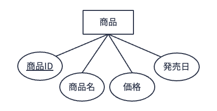
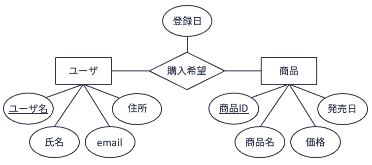
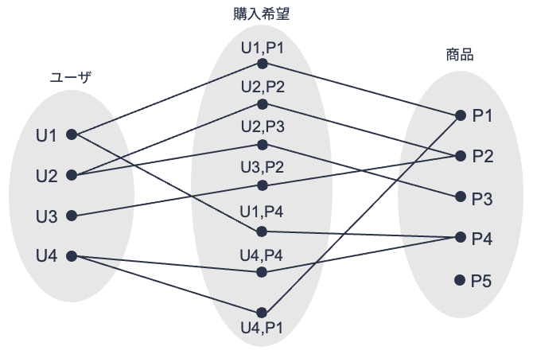
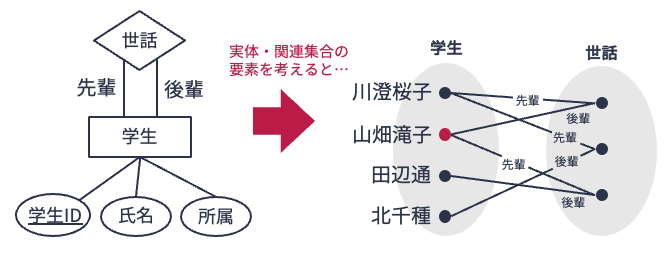

# 実体関連モデルとは

## データモデリングの流れ
関係データベースを設計するにあたり，いきなり完全無欠な複数の関係表（テーブル）を設計することは難しい．
これまでの解説で扱ってきたテーブルは高々数個であった．
しかし，実際のデータ管理の現場ではテーブル数が数十，数百になることはめずらしくない．
そのため，どれほど経験があるデータエンジニアであっても
- 冗長なデータがない
- 一貫性制約の保持が容易である

関係データベースを設計するには，対象とする事象やその中に存在するルールに対する理解を深めた上で，体系的にデータモデルを構築する必要がある．

以下の図に示すように，一般にデータモデリングは概念モデリング，論理モデリングの順で行われる．


**概念モデリング**は，最終的にどのようなデータベース技術を利用するかに関係なく，扱おうとするデータ対象がどのようなものであるか（どのような意味を持つか）を記述する手続きである．
概念モデリングにおいては，しばしば実体関連モデルが用いられる．

**論理モデリング**の過程では，概念モデリングで設計された概念モデルをデータベース管理システムが扱えるよう変換する．
例えば，データベース管理システムが関係データベース管理システムであれば，あらかじめ設計された概念モデルを関係データモデルに変換する．

以降では，代表的な概念モデルである実体関連モデルを解説した後，実体関連モデルを関係データモデルに変換する方法について述べる．


```{note}
### データモデリングは難しい!?
本章を含め，「データベース設計」の章で学ぶ概念はそれほど多くない．
しかしながら，実際にデータベース設計ができるようになるには時間がかかる．
設計は知識よりも経験がものを言うからである．

本章で学ぶ実体関連モデルも学習内容は多くない．
内容も一見すると大したことがないように見える．
しかし，初心者がいざ実体関連モデルを作ろうとすると，何をどうすればよいのか困ることだろう．
モデルを作ってみても，それが正しいものか不安になるだろう．

データモデリングを含め，抽象的な思考はとにかく「やってみては間違えるを繰り返す」しかない．
```


## 実体関連モデル
**実体関連モデル（entity-relationship model; ERモデル）** は，[Peter Chen](https://ja.wikipedia.org/wiki/%E3%83%94%E3%83%BC%E3%82%BF%E3%83%BC%E3%83%BB%E3%83%81%E3%82%A7%E3%83%B3)により提唱された概念モデリング用のデータモデルである．
実体関連モデルでは，実世界のデータのすべてを「実体」と「関連」の2種類で分類・記述する．
実体関連モデルを図として表現したものを**実体関連図（entity-relationship diagram; ER図）** と呼ぶ．

実体関連モデルおよび実体関連図には様々な記法・拡張が存在するが，本講義ではPeter Chenの記法に従い説明を行う．


### 実体
**実体（entity）** とは，データ対象をモデル化しようとしたときに，独立した存在として一意に識別可能な物体や事象である．
例えば，ショッピングサイトで取り扱う商品や購買記録をデータベースで管理することを考えよう．
そこに登場する（であろう）個々の
- ユーザ
- 商品
- 販売者
- 商品レビュー
- （ショッピングサイトにおける）カート

などは実体と見なすことができる．
なお，商品レビューやカートは物理的に存在するものではないが，概念的には独立した存在として識別可能な事象であるため実体となりえる．

同じ種類の実体の集合を**実体集合**と呼ぶ．
実体集合と実体は「集合とその要素（インスタンス）」の関係になる．
例えば，実体集合「商品」の要素としては，「はーいお茶」「午前の紅茶」「健康麦茶」などが考えられる．

実体集合の属性や一貫性制約を定めたものを**実体型（entity type）** と呼ぶ．
実体型は必ず1つ以上の**属性（attribute）** を持つ．
属性とは実体を特徴づける性質を表すものである．
例えば，実体集合「商品」の属性としては「商品ID」「商品名」「価格」「発売日」などがあげられる．

関係データモデルと同様，実体集合の実体（要素）を一意に識別（特定）するための極小な属性集合を**キー** と呼ぶ．
キーのうち，管理上最適と考えられるものを**主キー** と呼ぶ．
実体型は必ず主キーをもつ．

（Peter Chenの記法では）実体関連図において，
- 実体型は矩形
- 属性は楕円

で表現される．
なお，主キーとなる属性には**下線を引く**．
実体型とその属性は線で結ぶ．

下の図は，実体型「商品」を実体関連図として表現したものである（[★Quiz1★](#er-model1-q1)，[★Quiz2★](#er-model1-q2)，[★Quiz3★](#er-model1-q3)）．




```{note}
### 「一意に識別できる」とは？
実体や関連の定義において「一意に識別（特定）できる」という言い回しが使われる．
「事柄Xが（ある集合内において）一意に識別できる」とは「事柄Xが（集合内の）他の事柄と区別ができる」という意味である．

例えば実体型「商品」において「商品ID」が主キーとなっている場合，「商品IDをもって商品集合内の各商品を一意に識別できる」という意味になる．
これは「商品IDを見れば，（他の商品と区別して）ある商品を唯一1つに絞り込むことができる」という意味になる．
言い換えれば，実体集合「商品」においては，まったく同じ「商品」は存在しない（してはいけない）という意味になる．
```


### 関連
**関連（relationship）**[^関連]とは，複数の実体間のつながりを表す．
例えば，Amazonなどのショッピングサイトでしばしば提供されている，欲しい（購入希望の）商品をリスト化しておく「ウィッシュリスト」という機能を考えてみよう．
これを実体関連モデルで表現するならば，実体「ユーザ」と実体「商品」の間には，「欲しい（購入希望）」という関連が考えられる．
実体の定義において，実体とは「独立した存在として一意に識別される」と述べたが，関連はつながる実体の存在がなければ自身の存在を規定できない．
例えば「購入希望」の例では，ある購入希望（として登録する）という行為は行為主体であるユーザと行為対象である商品がそろって初めて定義できる．

同じ種類の関連の集合を**関連集合（relationship set）** と呼ぶ．
例えば，先の「購入希望」の例では，
- ユーザAが商品Xを購入希望登録したこと
- ユーザBが商品Yを購入希望登録したこと

など，個々のユーザが何かを購入希望登録したという行為の集合が関連集合「購入希望」となる．
関連集合内の各関連は，それとつながっている複数の実体によって**一意に識別される**．
もう少し具体的に言うと，ある関連はそれとつながっている実体の主キーの値が指定されたとき，一意に識別されなければならない．

関連型も属性を持つ場合がある（すなわち，属性がないこともある）．
例えば，先の関連型「購入希望」の例であれば，「登録日」などが属性として考えられる．

（Peter Chenの記法では）実体関連図において，
- 関連型はひし形
- その属性は楕円

で表現される．
関連型とその属性は線で結ぶ．
また，関連型はつながりのある実体型と線で結ぶ．

以下の図は，実体型「ユーザ」「商品」，および関連型「購入希望」を実体関連図として表現したものである．




[^関連]: 「関連」と「関係」は混同しやすいが異なる概念なので注意すること．「関連（relationship）」は実体関連モデルにおける概念で，複数の実体間のつながりを表す．一方，「関係（relation）」は数学や関係データベース上の概念で，集合の直積の部分集合を意味する．


以下の図は，上の実体関連図に示したモデルの実体および関連（つまり実体集合および関連集合の要素）の例を図示したものである．
スペースの都合上，実体および関連が持つ属性のうち，主キーの値のみを図示している．
関連「購入希望」の下に書かれた値は，各関連につながる実体の主キーの値のペアである（[★Quiz4★](#er-model1-q4)，[★Quiz5★](#er-model1-q5)）．




[^関連]: 関係データベースの話題において，関係と関連を混同しがちである．
関係（relation）は関係データモデル上の用語で，直積集合の部分集合（タプル集合）を意味する．
関連は実体関連モデル上の用語である．


### 役割の明示
ある大学ではデータベースを用いた学生情報の管理を検討しているとしよう．
さて，この大学ではどの学生も
- 自分の面倒を見てくれる「先輩」学生
- 面倒を見てあげる必要のある「後輩」学生

が割り当てられているとしよう．
このような状況を実体関連モデルで表現したい．

与えられた条件をふまえて
- 実体型として「先輩学生」と「後輩学生」，
- 先輩学生と後輩学生とのつながりを表す関連型として「世話」

を定義したとしよう．
この定義に従ってデータを管理しようとすると，面倒なことが起きる．
例えば，学生`山畑滝子`さんには`川澄桜子`さんという先輩と`田辺通`さんという後輩がいたとしよう．
この状況を先に定義した実体関連モデルで考えてみると，以下の図のように`山畑滝子`という唯一無二の実体が実体集合「先輩学生」と実体集合「後輩学生」のそれぞれの要素に現れてしまう．
検討しているデータベースでは学生情報を管理したいので，2つの実体集合に同じ情報が二重に登場するのはよろしくない．
学生は実体型「学生」だけで表現するのが望ましい．
先の実体関連モデリングは適切ではなかったのである．


実体型「学生」とその他の関連型のみで学生間の先輩後輩関係を表現できないだろうか．
これを実現するには，以下の実体関連図のように，実体型「学生」と関連「世話」の間に
- 先輩関係を表す直線
- 後輩関係を表す直線

を別々に引き，直線が意味する**役割**を明示すればよい（つまり2本の線を引く）．
このようにすることで，学生の概念を実体型「学生」だけに集約ができ，かつ先輩後輩の関係を表現できる．
今回の例のように，同一の実体型間に関連型が存在するケースでは，枝の上に役割を明示することで対応する（[★Quiz6★](#er-model1-q6)）．





```{note}
### 実体，関連，属性を見分ける経験則
何を実体として何を関連として見なすか，どれを属性として見なすか，迷うことがあるだろう．
実体関連モデルを提唱したPeter Chenは自身が発表した論文["English, Chinese and ER diagrams"](https://bit.csc.lsu.edu/~chen/pdf/ER_C.pdf)において，以下のような経験則を提案した．

- 普通名詞: 実体型
- 固有名詞: 実体
- 他動詞: 関連型
- 自動詞: 属性
- 形容詞: 実体の属性
- 副詞: 関連の属性

以上の経験則は当てはまらないこともあるが，目安にはなるので初学者は参考するとよい．
```

---

## クイズ

[Apple Music](https://music.apple.com/)や[Spotify](https://open.spotify.com/)，[LINE MUSIC](https://music.line.me/about/)などのサブスクリプション型音楽ストリーミングサービスでは，月額や年額でサービス使用料を支払うことで，好きなアーティストの好きな楽曲を好きなだけ聴くことができる．
ユーザは「プレイリスト」と呼ばれる，あるテーマをもとに楽曲を集めたリストを作成・公開することができる．
また，ユーザは別のユーザをフォローし，そのユーザが新しいプレイリストを作成すると通知を受け取ることができる．

下記クイズでは，架空のサブスクリプション型音楽ストリーミングサービス「Orange Music」の実体関連モデルについて考える．
なお，実体関連図の作成には[draw.io](https://app.diagrams.net/)を用いるとよい．


(er-model1-q1)=
### Q1. 実体（1/3）

Orange Musicの「ユーザ」は「ユーザID」「氏名」「性別」「誕生日」「電話番号」をもつ．
この状況を実体関連図で表現せよ．


(er-model1-q2)=
### Q2. 実体（2/3）

Orange Musicの「楽曲」は「楽曲ID」「楽曲名」「ジャンル」「長さ」をもつ．
この状況を実体関連図で表現せよ．


(er-model1-q3)=
### Q3. 実体（3/3）

Q2で定義した実体型「楽曲」の実体の例を2，3挙げよ．
なお，属性の値は適当に決めてよい．


(er-model1-q4)=
### Q4. 関連（1/3）

Orange Musicの「アーティスト」は「アーティストID」「アーティスト名」をもつ．
「アーティスト」は作成した「楽曲」をOrange Musicに「公開」する．
「公開」には「公開日」が記録される．
この状況を実体関連図で表現せよ．


(er-model1-q5)=
### Q5. 関連（2/3）

Orange Musicの「ユーザ」は「プレイリスト」に「作成」することがある．
「プレイリスト」は「プレイリストID」「プレイリスト名」「公開日」をもつ．
作成された「プレイリスト」には「楽曲」を「追加」することができる．
「追加」には楽曲がプレイリストに「追加された日」が記録される．
この状況を実体関連図で表現せよ．


(er-model1-q6)=
### Q6. 関連（3/3）

Orange Musicの「ユーザ」は別の「ユーザ」を「フォロー」する．
「フォロー」は「フォロー日」が記録される．
この状況を実体関連図で表現せよ．
