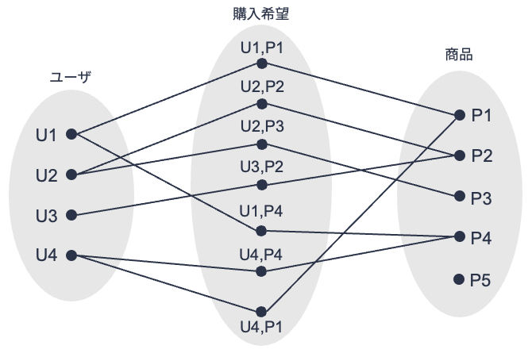
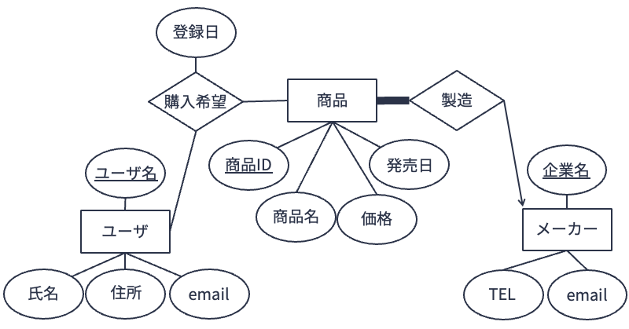

# 実体関連モデル上の一貫性制約
関係データモデルでは，対象となるデータが持つべき条件としてドメイン制約やキー制約といった一貫性制約を定義する．
実体関連モデルにおいても，データが持つべき一貫性制約を表現・設定する方法がいくつか用意されている．
以下，参加制約，多重度制約，キー制約について説明する（[★Quiz1★](#er-model2-q1)）．


## 参加制約
(fig:er-model-elements)=


上の図は，[第8回](/content/er-model/01.md)で用いたあるショッピングサイトにおける商品の「購入希望」に関する実体型および関連型の要素を示したものである．
上図の実体型「商品」に注目すると，どの実体「ユーザ」とも関連を持たない実体「商品」`P5`が存在することが分かる．
これは，誰も商品P5の購入を希望していないことを示している．

実体関連図上で実体型$E_1$と実体型$E_2$が関連型$R$でつながっているときに，対象としている問題設定によっては，実体集合$E_1$のすべての要素が関連集合$R$の要素とつながっている必要がある場合がある．
このようなケースを，$E_1$の$R$への参加は**全体的**であると呼ぶ．
逆に$E_1$の集合内の全要素が関連集合$R$の全要素とつながっている必要がない場合，$E_1$の$R$への参加は**部分的**であると呼ぶ．
例えば，上のショッピングサイトの図のケースの場合，実体型「商品」は関連型「購入希望」への参加が部分的である．
このように，ある実体型のある関連型への参加（つながり）が全体的か部分的かを定める制約を**参加制約（participation constraint）** と呼ぶ．

実体型$E$の関連型$R$への参加が全体的であるとき，実体関連図上では$E$と$R$の間の直線を**太線**にする．
例えば，先のショッピングサイトの例において，実体型「商品」の関連型「購入希望」への参加が全体的であるとするときは，以下のような実体関連図にする．


上の図のように定義することで，どの実体「商品」も必ずいずれかの関連「購入希望」とつながっていなければならなくなる
（上の図からは，実体「ユーザ」の中には関連「購入希望」とつながっていないもののある，つまり購入希望登録したことがないユーザが存在することを許す，ということも読み取れる）（[★Quiz2★](#er-model2-q2)）．


## 多重度制約
再びショッピングサイトの例に戻ろう．
以下の図は，購入希望登録に加えて，各商品がどのメーカーによって製造されたかの情報についても管理する実体関連モデルを設計し，それに基づき実体集合「ユーザ」「商品」「メーカー」および関連集合「購入希望」「製造」の要素を図示したものである．

(fig:er-model-elements2)=


（図が物語っていることがすべてであるとすると）この図からは，以下のことが分かる
1. ユーザは複数の商品を購入希望登録することができる
2. 商品は複数のユーザから購入希望登録されてもよい
3. ユーザの中には商品を購入希望登録をしない者がいてもよい
4. 商品の中にはユーザに購入希望登録されないものがあってもよい
5. 商品は必ず1つのメーカーによって製造される（複数のメーカーが合同で1つの商品を製造することはない）
6. メーカーは複数の商品を製造する
7. メーカーの中には商品を製造していないところがあってもよい

さて，これらのことを実体関連図として表現してみよう．
上記項目のうち，項目3，4，5，7については参加制約に関する事柄である．
すなわち，

- 実体型「ユーザ」の関連型「購入希望」への参加制約は「部分的」
- 実体型「商品」の関連型「購入希望」への参加制約は「部分的」
- 実体型「商品」の関連型「製造」への参加制約は「全体的」
- 実体型「メーカー」の関連型「製造」への参加制約は「部分的」

とすればよい．

一方，項目1，2，6（そして5）は，ある実体（要素）から見たときに，ある関連を通じて異なる実体（要素）と「いくつ」つながることが許されるかという制約を示している．
このように，ある関連に対して対応づけ可能な実体の数を**多重度（cardinality）** [^多重度]と呼ぶ．
また，多重度に関する制約を**多重度制約（cardinality constraint）** と呼ぶ．
実体間の関連は「1対1」「1対多」「多対多」のいずれかとなる．
例えば，上記図においては
- 関連「購入希望」はユーザと商品の「多対多」関連（項目1および2）
- 関連「製造」はメーカーと商品の「1体多」関連（項目5および6）

と見なせる．

実体関連図において，多重度は以下のように表現する．
- 1対1関連: 関連型から実体型に引かれた線をすべて矢印線にする
- 1対多関連: 関連型から「1」に対応する実体型に引かれた線のみを矢印線にする
- 多対多関連: 関連型から実体型に引かれた線をすべて直線にする（矢印は加えず，そのままにする）

例えば，[上の図](#fig:er-model-elements2)の内容を踏まえて実体関連図を設計すると，以下のような図になる．
関連型「製造」から実体型「メーカー」への線が矢印線になっていることが分かる（[★Quiz3★](#er-model2-q3)，[★Quiz4★](#er-model2-q4)，[★Quiz5★](#er-model2-q5)，[★Quiz6★](#er-model2-q6)）．

(fig:cardinality-constraint)=



[^多重度]: Cardinalityは多重度と呼ばれることもあるが，語源からすると「濃度」が正しい訳語とする説がある．


## キー制約
実体関連モデルにおける**キー制約（key constraint）** とは，キーとして指定された属性はキーとしての役割を必ず果たす必要があるという制約である．
例えば，実体型「学生」の属性「学籍番号」が主キーとして設定された場合，学籍番号を指定することにより実体「学生」は一意に特定できなければならない．
また，学籍番号に重複は許されない．

(sec:weak-entity)=
### 弱実体と部分キー
ショッピングサイトの例に戻ろう．
ショッピングサイトを利用する際，ある人が自分のユーザ名を使ってログインをしているのだが，購入した商品の送り先を同居する家族の名前にしたいケースがある．
このようなケースに対応するため，サイト運営者は先ほど示した[実体関連図](#fig:cardinality-constraint)を改善して，
- 実体型「家族」を追加
- 実体「ユーザ」と実体「家族」が同居関係にあることを示すために，関連型「同居」を追加

すること検討しているとしよう．
なお，「家族」にはユーザ名は割り振られず，家族の誰かに商品を送るときは，その家族のユーザがサイトにログインをして手続きをすることを想定している．

このような条件で実体関連図を作成すると，拡張した箇所は以下の図のようになる．
図中では，実体型「家族」は「氏名」「続柄」のみを属性として持っている．
なお，「氏名」は実体型「家族」の主キーに設定していない．
主たるユーザがいてこその「家族」であり，「家族」を独立して管理する意味がないからである．

さて，このような設計をすると，あるユーザを特定すると，そのユーザに「同居」関連で紐付いている実体「家族」については「氏名」によって特定は可能である．
しかし，（「ユーザ」の情報なしに）「氏名」だけですべての「家族」実体集合の中である実体「家族」を特定することはできない．
これは，実体集合「家族」は自身がもつ属性だけでは主キーを構成できないことを意味する．


このように，自身がもつ属性だけでは主キーを構成できない実体集合を**弱実体集合（weak entity set）** と呼ぶ．
弱実体集合のある弱実体を一意に特定するためには，
- それと何らかの関連でつながっている実体の主キー，および
- 関連する実体が特定されたときにのみ，それと関連する弱実体の特定に有効な属性

をセットで指定する必要がある．

弱実体を特定する上で，それと関連している実体のことを**所有実体（owner entity）** と呼ぶ．
弱実体と所有実体をつなげる関連を**弱関連（weak relationship）** と呼ぶ．
また，弱実体を一意に特定するために，所有実体の主キーとセットにして使われる弱実体の属性を**部分キー（partial key）** と呼ぶ．
実体関連図において，弱実体型は太字の矩形，弱関連型は太字のひし形で記される[^弱実体・弱関連の記法]．
また，部分キーには点線をつける．

上の図の例においては，
- 実体「家族」が弱実体（「氏名」が部分キー）
- 実体「ユーザ」が（弱実体「家族」に対する）所有実体
- 関連「同居」が弱関連

となる（[★Quiz7★](#er-model2-q7)）．

[^弱実体・弱関連の記法]: 弱実体と弱関連は太字でなく，二重線で表現されることもある．


```{note}
### 弱実体はなぜ「弱」いのか？

上の実体関連図の例において，実体「家族」が弱実体とされていた．
読者によっては，実体「家族」にも主キーを持たせて，所有実体「ユーザ」の主キーがなくても一意に特定できるようにすればよいのでは，と考えた方がいるかもしれない．
そのようにすることも理屈上可能であるが，「家族」をあえて弱実体にしているのは，対象としているショッピングサイトの運用指針にも関係している．

例に挙げているショッピングサイトにおいては，あくまでユーザIDをもつ「ユーザ」が販売活動の中心となる．
あるユーザの「家族」に商品を送るというのは，その家族がユーザのIDを借りて商品を買っていると見なせる．
これは，ユーザIDを持つユーザが家族にいなければ，商品を送ってもらえない（買えない）ことを意味する．
つまり，弱実体「家族」は実体「ユーザ」が存在しなければ，存在できない「弱い存在」なのである．

弱実体の定義は「それと関連する実体の主キーと自身の部分キーをもって，はじめて自身を特定できる実体」と定義していたが，個人的には

> 関連する実体がなくなってしまうと，自分自身も消えてしまう（登録抹消されてしまう）ような実体が弱実体

と考えている．
```

---


## クイズ
[Apple Music](https://music.apple.com/)や[Spotify](https://open.spotify.com/)，[LINE MUSIC](https://music.line.me/about/)などのサブスクリプション型音楽ストリーミングサービスでは，月額や年額でサービス使用料を支払うことで，好きなアーティストの好きな楽曲を好きなだけ聴くことができる．
ユーザは「プレイリスト」と呼ばれる，あるテーマをもとに楽曲を集めたリストを作成・公開することができる．
また，ユーザは別のユーザをフォローし，そのユーザが新しいプレイリストを作成すると通知を受け取ることができる．

下記クイズでは，架空のサブスクリプション型音楽ストリーミングサービス「Orange Music」の実体関連モデルについて考える．
なお，実体関連図の作成には[draw.io](https://app.diagrams.net/)を用いるとよい．


(er-model2-q1)=
### Q1. 復習
Orange Musicの「ユーザ」は「ユーザID」「氏名」「性別」「誕生日」「電話番号」をもつ．
Orange Musicの「アーティスト」は「アーティストID」「アーティスト名」をもつ．
Orange Musicの「楽曲」は「楽曲ID」「楽曲名」「ジャンル」「長さ」をもつ．
「アーティスト」は作成した「楽曲」をOrange Musicに「公開」する．
「公開」には「公開日」が記録される．
Orange Musicの「ユーザ」は「プレイリスト」を「作成」することができる．
「プレイリスト」は「プレイリストID」「プレイリスト名」「公開日」をもつ．
作成された「プレイリスト」には「楽曲」を「追加」することができる．
「追加」には楽曲がプレイリストに「追加された日」が記録される．

この状況を実体関連図で表現せよ．
なお，Q1で作成する実体関連図作成においては，参加制約，多重度制約，キー制約は考慮しなくてよい．


(er-model2-q2)=
### Q2. 参加制約
Q1で作成した実体関連図において参加が「全体的」となる実体型と関連型のペアを考え，それを実体関連図に反映させよ．


(er-model2-q3)=
### Q3. 多重度（1/4）
Q1の設定に以下を追加する．

> 「レーベル」は「レーベル名」「住所」をもつ．
> 「アーティスト」はいずれか1つの「レーベル」に「所属」し，「レーベル」には何組かの「アーティスト」が「所属」する．

Q2で作成した実体関連図に，上記追加設定を反映させよ．


(er-model2-q4)=
### Q4. 多重度（2/4）
Q3の設定に以下を追加する．

> 「アーティスト」はいくつかの「楽曲」を「公開」する．
> 「ユーザ」はいくつかの「楽曲」を「プレイリスト」に「追加」する．
> ある「プレイリスト」を作成した「ユーザ」は必ず一人である．

Q3で作成した実体関連図に，上記追加設定を反映させよ．


(er-model2-q5)=
### Q5. 多重度（3/4）
Q4の設定に以下を追加する．

> 「ユーザ」は気に入った「楽曲」に「いいね」をすることができる．「ユーザ」は何曲でも「いいね」できる．
> 「いいね」は「いいねされた日（liked_at）」が記録される．

Q4で作成した実体関連図に，上記追加設定を反映させよ．


(er-model2-q6)=
### Q6. 多重度（4/4）

Q5で作成した実体関連モデルについて，参加制約や多重度制約の特徴が分かるよう，実体集合，関連集合とそれに対応する要素の例を[こちらの図](#fig:er-model-elements2)のような形式で図示せよ．


(er-model2-q7)=
### Q7. 弱実体と部分キー

Q5で作成した実体関連図において「弱実体」「弱関連」になり得るものを特定し，それを実体関連図に反映させよ．
なお，弱実体の部分キーには点線を付与すること．
