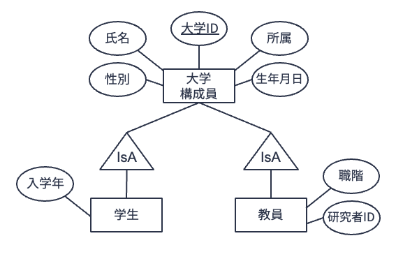
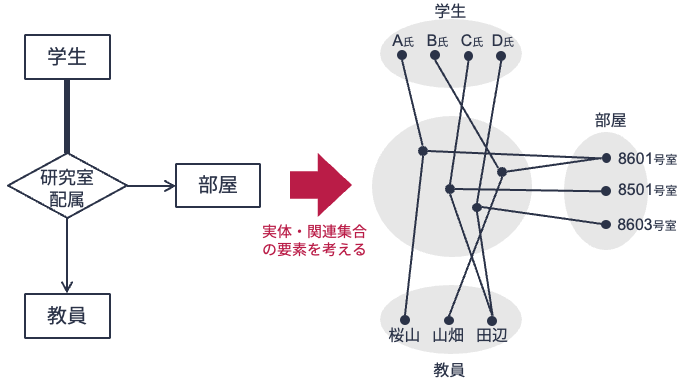
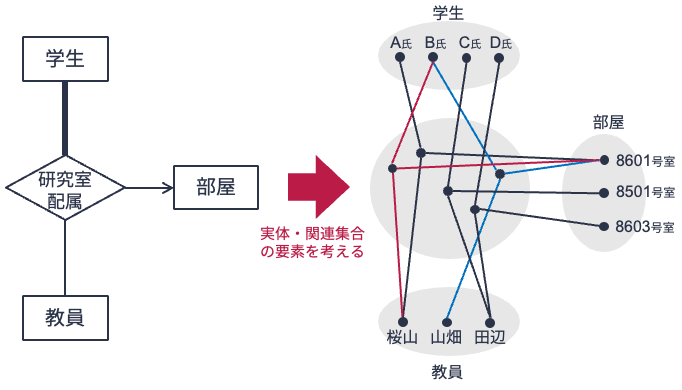

# 拡張実体関連モデル & n項関連

## 汎化・継承（IsA階層）
実体関連モデルに対して，いつかの拡張概念が提案されている．
そのうちのひとつが，**汎化・継承** の概念である．

実世界を実体関連モデルで表現する際，実体集合間にある種の包含関係（階層関係）が想定されることがしばしばある．
例えば，実体型「大学構成員」「学生」「教員」を考えてみよう．
学生も教員も大学を構成するメンバーである．
そのため「大学構成員」と「学生」「教員」の間には包含関係があると見なせる．

ある大学のデータ管理者は，大学構成員の情報を管理する上で，
- 学生には「大学ID」「氏名」「生年月日」「性別」「所属」と「入学年」
- 教員には「大学ID」「氏名」「生年月日」「性別」「所属」と「研究者ID」「職階」

の情報を持たせるたいと考えているとする．

実体関連モデルで実体型「学生」「教員」を定義してみよう．
あらかじめ，「大学ID」「氏名」「生年月日」「性別」「所属」を属性とする実体型「大学構成員」が定義されているとする．
このとき，

> 実体型「学生」は属性「大学ID」「氏名」「生年月日」「性別」「所属」「入学年」を持つ実体型である

と定義するよりも，

>  実体型「学生」は実体型「大学構成員」に属性「入学年」を加えた実体型である

と定義したほうが明らかに無駄が少ない．また自然である．
実体型「教員」の定義においても同様である．

このように，実体型$E_1$が持つすべての属性を持つと考え，新たな実体型$E_2$を定義するとき，$E_2$は$E_1$を**継承（inherit）** したという（「$E_1$は$E_2$を**汎化（generalize）** した実体型である」と称することもある）．
継承を用いて実体型を表現したとき，その実体集合（下位の集合）は継承元（上位）の実体集合にすべて包含される．

実体関連図において，継承元となる上位の実体型と継承先となる下位の実体型の間には，汎化・継承関係があることを示す「IsA」と記した三角の特別な関連記号を置く．
以下は，先の実体型「大学構成員」「学生」「教員」を実体関連図で表現したものである（[★Quiz1★](#er-model3-q1)）．

## n項関連
これまでの説明では扱ってきた関連型は，2つの実体型とのつながりを表現したもの（2項関連）に限定されていたが，3つ以上の実体型とつながりがあってもよい．
n個の実体型をつなぐ関連を**n項関連（n-ary relationship）** と呼ぶ．
2項関連と同様に，n項関連においても参加制約や多重度制約を考えることができる．

上の図は，学生がどこの教室でどの教員の指導をうけるかを実体関連図で表現した図（左）および各実体集合，関連集合の要素を示した図（右）である．
上図では，関連型「研究室配属」は実体型「学生」「部屋」「教員」の3項関連となっている．
また，実体関連図が示しているように，関連型「研究室配属」において，
- 「学生」と「教員」は多対1の関連
- 「学生」と「部屋」は多対1の関連

となっている．
つまり，学生の指導教員は必ず1名であり，部屋割もどこかの部屋を1つしか割り当てられないことになっている．

一方，上の図は先ほど同様，学生がどこの教室でどの教員の指導をうけるかを表した実体関連図および各実体集合，関連集合の要素を示した図ではあるが，実体関連図で表現されている内容が微妙に異なる．
上の実体関連図においては，
- 「学生」と「教員」は多対多の関連
- 「学生」と「部屋」は多対1の関連

となっている．
つまり，学生に割り当てられられる部屋は必ず1つであるが，学生1名につき2名以上の教員を指導教員として割り当てることができる，と読み取れる．
上の右図を見ると，学生Bの割り当て部屋は8601号室であるが，指導教員として桜山先生と山畑先生の2名が割り当てられていることが分かる（[★Quiz2★](#er-model3-q2)，[★Quiz3★](#er-model3-q3)）．

---

## クイズ
[Apple Music](https://music.apple.com/)や[Spotify](https://open.spotify.com/)，[LINE MUSIC](https://music.line.me/about/)などのサブスクリプション型音楽ストリーミングサービスでは，月額や年額でサービス使用料を支払うことで，好きなアーティストの好きな楽曲を好きなだけ聴くことができる．

下記クイズでは，架空のサブスクリプション型音楽ストリーミングサービス「Orange Music」の実体関連モデルについて考える．
以下，想定している実体関連モデルの詳細である．

- Orange Musicの「ユーザ」は「ユーザID」「氏名」「性別」「誕生日」「電話番号」をもつ．
- Orange Musicの「アーティスト」は「アーティストID」「アーティスト名」をもつ．
- Orange Musicの「楽曲」は「楽曲ID」「楽曲名」「ジャンル」「長さ」をもつ．
- 「アーティスト」は作成した「楽曲」をOrange Musicに「公開」する．
- 「公開」には「公開日」が記録される．
- Orange Musicの「ユーザ」は「プレイリスト」を「作成」することができる．
- 「プレイリスト」は「プレイリストID」「プレイリスト名」「公開日」をもつ．
- 作成された「プレイリスト」には「楽曲」を「追加」することができる．
- 「追加」には楽曲がプレイリストに「追加された日」が記録される．

上記前提に基づき，下記のクイズに答えよ．
実体関連図の作成には[draw.io](https://app.diagrams.net/)を用いるとよい．
なお，ベースとなる実体関連図として，[第9講](/content/er-model/02.md)のクイズ回答で作成したものを用いると楽である．

(er-model3-q1)=
### Q1. 汎化・継承
Orange Musicは追加サービスとして「プレミアムユーザ」サービスを開始した．
Orange Musicの「ユーザ」は追加料金を支払うことで「プレミアムユーザ」になることができる．
「プレミアムユーザ」は最大100曲まで「楽曲」を「ダウンロード」できる．
「ダウンロード」には「ダウンロード日」を記録する．

クイズの前提，および追加状況を表現する実体関連図を作成せよ．

(er-model3-q2)=
### Q2. n項関連（1/2）
Orange Musicでは追加サービスとして，アーティストがコンサート等のイベントで演奏した曲目（いわゆるセットリスト）を閲覧できるサービスを開始することにした．
このサービスでは，「アーティスト」がどの「楽曲」をどの「イベント」で「演奏」したのかを閲覧できる．
「イベント」は「イベント名」「場所」「日時」を情報としてもつ．
また，「演奏」にはイベント中の演奏順序を示す「演奏番号」が記録される．
なお，「アーティスト」が「演奏」した「楽曲」は他者が制作した楽曲も含まれる．

この状況を実体関連図で表現せよ．

(er-model3-q3)=
### Q3. n項関連（2/2）
[第9講](/content/er-model/02.md)の講義資料で用いた[オンラインショッピングの例](#fig:cardinality-constraint)に戻ろう．
このオンラインショッピングサイトでは，「ユーザ」がどの「商品」を「購入」したかを記録している．
購入記録においては，購入した「商品」の「数量」や「購入日」の情報を記録している．

この状況を[オンラインショッピングの例](#fig:cardinality-constraint)の実体関連図に追記する形で表現せよ．
