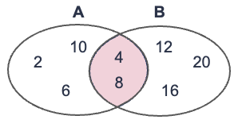
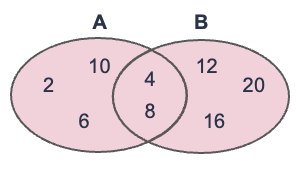
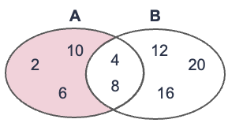
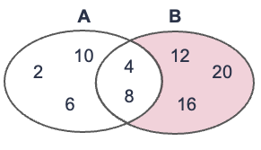
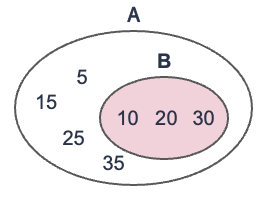
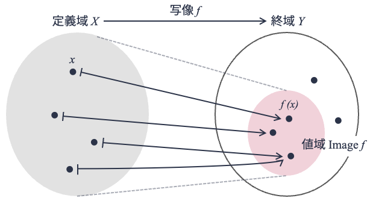

(chapter:math)=
# 集合と写像
関係データベースのデータモデルである関係データモデルは，代数学，特に集合と写像に関する数学理論に支えられている．
関係データモデルを理解するためにはこれらの知識が必要となるため，以下，最低限必要となる集合と写像の知識を説明する．

以下の説明はかなり形式的である．
当たり前のことを記号をふんだんに使って説明しているが，**物事を抽象化して捉えるためには記号的（数学的）な道具が必要になる**ので，嫌がらず読んでほしい（ただし気負いすぎないこと）．
なお，集合と写像について知識がある読者は，本節を読み飛ばしても問題ない．

## 集合
数学における**集合（set）** とは，何かを集めたものである．
集合を構成する個々の「何か」は **要素（あるいは元; element）** と呼ばれる．

例えば，以下は集合の例である．

> $\{1, 2, 3\}$

上記集合は整数1，2，3を要素として集めたものである．
1，2，3はそれぞれ集合{1, 2, 3}の要素である．
一般に，集合は波カッコの中に要素を並べて表現する．

集合には名前がつけられる．
例えば，上記集合について

> $A = \{1, 2, 3\}$

とすれば，集合$\{1, 2, 3\}$を集合Aと呼ぶことができる．
なお，慣習上，集合をアルファベットで表すときは**大文字アルファベット1文字**，集合の要素をアルファベットで表すときは**小文字アルファベット1文字**を使う（例外ケースもある）．

ある要素がある集合に属していることは，記号$\in$を用いて表現する．
例えば，整数1が集合Aに属していること（つまり集合Aの要素であること）は

> $1 \in A$

と書ける．
一方，ある要素がある集合に属して「いない」ことは，記号$\notin$を用いて表現する．
例えば，整数7が集合Aに属していないことは

> $7 \notin A$

と書ける．

集合の要素は数に限らない．
例えば，以下の平仮名集合Hのように文字の集合もありうる．

> $H = \{あ, い, う, え, お, ...., わ, を, ん\}$

なお，**集合の要素間の順序関係は無視**される[^順序集合]．
それゆえ，集合$A=\{1, 2, 3, 4, 5\}$と$B=\{5, 4, 3, 2, 1\}$はまったく同じ集合となる．
つまり，

> $A=B$

となる．
また，（数学的な定義の）**集合の要素は重複してはならない**[^多重集合]．
重複する要素があった場合は，重複は無視して扱われる．
例えば，$A=\{1, 3, 5, 7, 7\}$は$A=\{1, 3, 5, 7\}$として扱われることになる．

[^順序集合]: 集合の要素間に順序関係が定義された集合は特別な集合であり，**順序集合（ordered set）** と呼ばれる．
[^多重集合]: 集合の要素に重複を許した集合を**多重集合（multiset）** と呼ぶ．

### 集合の外延的定義と内包的定義
集合の定義（表記）方法には2種類ある．

1つは**外延的定義**である．
これは，集合の要素を具体的に列挙することで集合を定義する方法である．
例えば，

> $A = \{2, 4, 6, 8, 10, 12, 14, 16, 18, 20\}$

は「20以下の偶数」である集合Aを外延的定義によって定義したものである．
外延的定義では集合の要素をすべて列挙するのが大変なため，以下のように途中の要素をテンテンで省略して書く場合もある．

> $A = \{2, 4, 6, ..., 18, 20\}$

2つめの定義方法は**内包的定義**である．
外延的定義では要素を具体的に列挙するのに対して，内包的定義では集合の要素が満たすべき条件（性質）を示すことで集合を定義する．
例えば，前述の集合Aであれば，

> $A = \{ 2n \ | \ nは整数かつ0\leq n \leq 10\}$

と書ける．内包的定義では波カッコの中を縦棒（|）で区切り，左側に集合の要素を表す文字を書き，右側には要素に関する条件を書く．
なお，条件のAND（「かつ」）は以下のようにカンマで書くこともある．

> $A = \{ 2n \ | \ nは整数, 0\leq n \leq 10\}$

### よく使われる数の集合
整数，自然数のように，よく使われる数の集合には特別な集合名が付けられている．
以下，代表的な数の集合を列挙しておく．

$\mathbb{Z}$は，**整数全体をあらわす集合**である．
すなわち，
> $\mathbb{Z} = \{..., -2, -1, 0, 1, 2, ... \}$.

例えば，$-7 \in \mathbb{Z}$であり，$0.3 \notin \mathbb{Z}$である．

$\mathbb{N}$は，**自然数全体をあらわす集合**である．
すなわち，
> $\mathbb{N}= \{1, 2, 3, ... \} = \{ n \ | \ n \in \mathbb{Z}, n \geq 1 \}$.

$\mathbb{R}$は，**実数全体をあらわす集合**である．
例えば，$\sqrt{3} \in \mathbb{R}$，$\pi \in \mathbb{R}$，$e \in \mathbb{R}$であり，$1+1i \notin \mathbb{R}$，$文字 \notin \mathbb{R}$である（[★Quiz1★](#Q1)，[★Quiz2★](#Q2)）．

### 空集合
要素を持たない集合も集合である．
そのような集合を**空集合**と呼ぶ．
空集合は$\phi$で表す．
すなわち，
> $\phi = \{\}$．

### 集合の要素数
集合Xの要素数は，$|X|$と表記する．
例えば$A=\{1, 2, 3, 4, 5\}$のとき，$|A|=5$である．
また，

> $Z_n = \{0, 1, 2, 3, ...., n-1\} = \{x \ | \ x \in \mathbb{Z}, 0 \leq x \le n \}$

のとき，$|Z_n| = n$ となる．

要素を持たない集合も集合である．
そのような集合を**空集合**と呼ぶ．
空集合は$\phi$で表す．
すなわち，
> $\phi = \{\}$．

### 積集合（集合の共通部分）
2つの集合A，Bが与えられたとき，集合A，Bに共通の要素を集めた集合を**積集合（あるいは共通集合; intersection）** と呼ぶ．
集合Aと集合Bの積集合は$A \cap B$と記す．
積集合$A \cap B$の内包的定義は以下の通り：

> $A \cap B = \{ x \ | \ x \in A かつ x \in B\}$

以下の図は，集合$A=\{2, 4, 6, 8, 10\}$と集合$B=\{4, 8, 12, 16, 20\}$の積集合$A \cap B$をベン図で表している．
このケースでは$A \cap B = \{4, 8\}$となる．

### 和集合
2つの集合A，Bが与えられたとき，集合A，Bのいずれかに属する要素を集めた集合を**和集合（union）** と呼ぶ．
集合Aと集合Bの和集合は$A \cup B$と記す．
和集合$A \cup B$の内包的定義は以下の通り：

> $A \cup B = \{ x \ | \ x \in A または x \in B\}$

以下の図は，集合$A=\{2, 4, 6, 8, 10\}$と集合$B=\{4, 8, 12, 16, 20\}$の和集合$A \cup B$をベン図で表している．
このケースでは$A \cup B = \{2, 4, 6, 8, 10, 12, 16, 20\}$となる．

### 差集合
2つの集合A，Bが与えられたとき，集合Aには属しているが集合Bには属していない要素を集めた集合をBからAを引いた**差集合（set difference）** と呼ぶ．
集合Bから集合Aを引いた差集合を$B-A$または$B \setminus A$と記す．
差集合$B-A$の内包的定義は以下の通り：

> $B-A = \{ x \ | \ x \in B かつ x \notin A\}$

以下の図は，集合$A=\{2, 4, 6, 8, 10\}$から集合$B=\{4, 8, 12, 16, 20\}$を引いた差集合$A-B$をベン図で表している．
このケースでは$A-B = \{2, 6, 10\}$となる．

以下は，集合Bから集合Aを引いた差集合$B-A$を表したベン図である．
このケースでは$B-A = \{12, 16, 20\}$となる．
2つの図を比較したら分かるように，差集合$A-B$と$B-A$は異なる（[★Quiz3★](#Q3)）．

### 部分集合
2つの集合A，Bが与えられたとき，集合Bが集合Aの一部としてすっぽり入っているとき，集合Bは集合Aの**部分集合（subset）** であるという．
もう少し堅い定義をすると，集合Bの任意の要素（あらゆる要素）が集合Aに属するとき，集合Bは集合Aの部分集合である，とする．
集合Bが集合Aの部分集合であることを，$B \subset{A}$と記す．

例えば，以下の図では集合$A=\{5, 10, 15, 20, 25, 30, 35\}$と集合$B=\{10, 20, 30\}$であり，
集合Bの要素はすべて集合Aの要素なので，$B \subset{A}$となる（[★Quiz4★](#Q4)）．

### 直積
2つの集合AとBが与えられたとき，Aの要素とBの要素を1つずつ取り出して作れるすべての組（ペア）を集めた集合を**直積集合（Cartesian productあるいはdirect product）** あるいは単に**直積**と呼ぶ．
集合AおよびBの直積集合は$A \times B$と記す．
直積集合$A \times B$の内包的な定義は以下の通り：

> $A \times B = \{ (a, b) \ | \ a \in A, b \in B \}$．

例を見てみよう．
例えば，$A=\{1, 3, 5\}$，$B=\{2, 4, 6\}$のとき，AとBの直積は

> $A \times B = \{ (1, 2), (1, 4), (1, 6), (3, 2), (3, 4), (3, 6), (5, 2), (5, 4), (5, 6) \}$

となる．

もう1つ例を見てみよう．
直積$\mathbb{R} \times \mathbb{R}$は2つの実数の組の集合になる．
1つ目の$\mathbb{R}$の要素をx座標の値，2つ目の$\mathbb{R}$の要素をy座標の値とすれば，$\mathbb{R} \times \mathbb{R}$は2次元平面と見なすことができる．

最後に数値ではない直積の例を見てみよう．
集合$C = \{データベース, 機械学習\}$，集合$D=\{優, 良, 可, 不可\}$が与えられたとき，
集合Cと集合Dの直積は，

> $C \times D = \{(データベース, 優), (データベース, 良), (データベース, 可), (データベース, 不可),\\ \ \ \ \ \ \ \ \ \ \ \ \ \ \ \ \ \ \ \ (機械学習, 優), (機械学習, 良), (機械学習, 可), (機械学習, 不可)\}$

となる．

**関係データベースは直積と関連が深い．**
高校数学では学ばなかった（と思われる）直積であるが，きっちり概念を押さえておこう（[★Quiz5★](#Q5)）．

## 写像
**写像**とは，2つの集合間の対応づけを表すものである．
集合$X$に属するどの要素も，ルール$f$で集合$Y$に属するいずれかの要素に対応づけすることが可能なとき，$f$を「$X$から$Y$への写像」と呼ぶ．
$f$が$X$から$Y$への写像であることを，以下のように記す．

> $f: X \to Y$

また，写像$f$によって集合$X$の要素$x$が集合$Y$の要素$y$に対応することを，以下のように記す（**矢印の種類が異なることに注意**）．

> $f: x \mapsto y$

このとき，$y$を写像$f$による要素$x$の**像（あるいは値）** と呼び，$f(x)$と記すこともできる．

最も馴染みのある写像の一つは関数である．
例えば，小売店で商品を購入する際には，商品価格$x$に対して消費税10\%分を加算した料金を支払う．
最終的な支払い料金$y$を計算する関数$f$は

> $y= f(x)= 1.1x$

と書ける．
商品価格や最終的な支払い料金は実数であり，関数$f$は実数から実数への写像になるため，

> $f: \mathbb{R} \to \mathbb{R}$

と書くことができる．
また，

> $f: x \mapsto 1.1x $

と書くこともできる．

関数ではない現実的な写像の例を示そう．
大学では，学生が履修した科目に対して「優」「良」「可」「不可」の4段階の成績が付けられることが多い．
今，集合$S$は学生の集合，集合$C$は科目の集合としたとき，集合$S$と$C$の直積集合$S \times C$は（考えられうる）学生の科目の履修状況と見なせる（見なすことにしよう）．
例えば，$S= \{山畑滝子, 川澄桜, ... \}$，$C=\{線形代数, データベース, ...\}$とすると，
> $S \times C = \{(山畑滝子, 線形代数), (山畑滝子, データベース), (川澄桜, 線形代数), ... \}$

といった感じになる．

さて，成績の種別を表す集合を$U = \{優, 良, 可, 不可\}$とすると，各学生の各科目に成績を付けるという行為（$f_{採点}$）はまさに集合$S \times C$から$U$への写像と見なすことができる．
よって，以下のように書くことができる．

> $f_{採点}: S \times C \to U$

#### 定義域と値域
上で写像$f: X \to Y$の概念を導入したが，写像元と写像先に名前を付けておくと便利なため，3つの概念を導入する．

1つ目は定義域である．
集合$X$から集合$Y$への写像$f$が与えられたとき，集合$X$を写像$f$の**定義域**と呼ぶ．

2つ目は終域である．
集合$X$から集合$Y$への写像$f$が与えられたとき，集合$Y$を写像$f$の**終域**と呼ぶ．

3つ目は値域である．
集合$X$から集合$Y$への写像$f$が与えられたとき，$f$によって写された集合$X$の要素の集合を写像$f$の**値域**と呼ぶ．
値域は$\mathrm{Image} f$と記される．
値域は少しややこしいが，定式化すると以下のように書ける

> $\mathrm{Image} f = \{f(x) \ | \ x \in X \}$

終域と値域の違いが分かりづらいかもしれないが，
値域は終域の要素（$y \in Y$）の中でも，$y=f(x)$を満たすような$x$が存在する$y$の集合を表す．
図にすると以下のようになる（図は「[群論への第一歩（結城浩著, SBクリエイティブ）](https://www.sbcr.jp/product/4815621353/)」から山本が書き起こし編集）（[★Quiz6★](#Q6)）．

---

## クイズ

(Q1)=
### Q1. 外延的定義
以下の集合$S_1$，$S_2$，$S_3$を外延的定義で記せ．
ただし
 - $S_{name} = \{yamabata, kawasumi, tanabe\}$
 - 関数$f(x)$は文字列xを"x@nagoya-c.ac.jp"という文字列に変換する関数

とする．

$S_1 = \{2x \ | \ x \in \mathbb{N}, 1 \leq x \leq 10  \}$

$S_2 = \{3x \ | \ x \in \mathbb{N}, x < 6  \}$

$S_3 = \{f(x) \ | \ x \in S_{name}\}$

(Q2)=
### Q2. 内包的定義
以下の集合$S_4$，$S_5$，$S_6$を内包的定義で記せ．

$S_4 = \{-3, -2, -1, 0, 1, 2, 3\}$

$S_5 = \{3, 8, 13, 18, 23 \}$

$S_6 = \{-3, -8, -13, -18, -23 \}$

(Q3)=
### Q3. 和集合，積集合，差集合
上記Q1およびQ2で扱った集合をもとに，以下の集合の要素を求めよ．

$S_7 = S_1 \cup S_2$

$S_8 = S_1 \cap S_2$

$S_9 = S_1 - S_2$

$S_{10} = S_2 - S_1$

(Q4)=
### Q4. 部分集合
集合$A$，$B$，$C$を以下のように定義する．

$A = \{線形代数, 微分積分\}$

$B = \{線形代数, 微分積分, データ構造, データベース, 機械学習\}$

$C = \{\{線形代数, 微分積分\}, B \}$

このとき，以下の1からの命題が真か偽かを求めよ．

1. $データベース \in B$
2. $データベース \subset B$
3. $A \in B$
4. $A \subset B$
5. $A \in C$
6. $A \subset C$
7. $|A| = |B|$
8. $|A| = |C|$

※ 本問題は[書籍「群論への第一歩: 集合、写像から準同型定理まで」](https://www.sbcr.jp/product/4815621353/)に掲載された問題の改題である．

(Q5)=
### Q5. 直積
集合$S_{pref}$および$S_{city}$を以下のように定義する．

$S_{pref} = \{愛知, 岐阜, 三重\}$

$S_{city} = \{名古屋, 岐阜, 津, 京都\}$

このとき，集合$S_{pref} \times S_{city}$ の要素をすべて求めよ．

(Q6)=
### Q6. 写像
Q5で扱った集合$S_{pref}$と$S_{city}$を再び用いる．

写像$f$は集合$S_{pref} \times S_{city}$から集合$\mathbb{R}$の写像であり，
$p \in S_{pref}$，$c \in S_{city}$に対して，

$$
    f(p, c) =
        \begin{cases}
            1 \quad 都市cが都道府県pの県庁所在地の場合 \\
            0 \quad それ以外 \\
        \end{cases}
$$

と定義する．

1. 写像$f$の定義域，値域，像を列挙せよ．
2. $S = \{(x, y) | \ (x, y) \in S_{pref} \times S_{city}, f(x, y) = 1\}$となる集合$S$の要素を求めよ．
